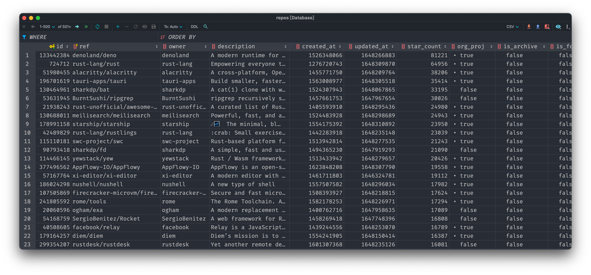

# Schema Specifications

| Column        | Data Type | Description         |
|--------       |-----------|---------------------|
| id            | uint      | formal id in GitHub |
| ref           | string     | repository name |
| owner         | string     | repository owner |
| language      | string     | main programming language of the repository |
|default_branch | string     | default branch of the repository |
| is_fork       | bool      | whether the repository is forked from another one |
| is_archive    | bool      | whether the repository is archived |
| is_template   | bool      | whether the repository is a template repository |
| org_proj      | bool      | whether the repository is maintained by a orgnization |
| size          | uint      | storage space size |
| star_count    | uint    | number of stars |
| fork_count    | uint    | number of repositories that is forked from this one |
| create_at     | uint    | create time (in UNIX timestamp) | 
| update_at     | uint    | last update time (in UNIX timestamp) | 